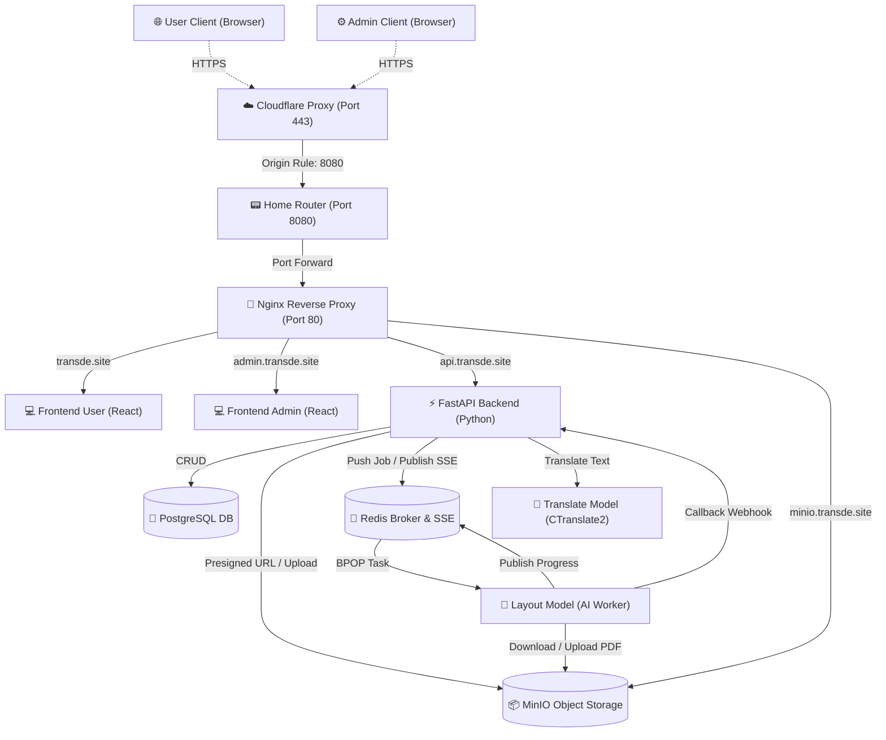

# 🌐 HUS AI Translator — Tổng Quan Module & Đặc Tả Mã Nguồn (Core Code Specification)

HUS AI Translator là một giải pháp dịch thuật tài liệu tự động đa phương thức ứng dụng các mô hình AI tiên tiến, tối ưu hóa cho cặp ngôn ngữ Anh - Việt. Hệ thống được đóng gói hoàn toàn dưới dạng **Microservices** chạy qua Docker Compose, tích hợp hệ thống bảo mật & tối ưu hóa định tuyến của **Cloudflare** nhằm vượt qua các hạn chế cổng mạng gia đình.

Tài liệu này đặc tả chi tiết **vai trò của từng module** và **các tệp tin mã nguồn cốt lõi (Core Code)** thực thi luồng logic chính của hệ thống.

---

## 🏗️ Kiến Trúc Tổng Quan (System Architecture)

Hệ thống được thiết kế theo mô hình kiến trúc hướng dịch vụ (SOA) chia nhỏ thành 9 module (dịch vụ) độc lập tương tác qua mạng nội bộ Docker. Mô hình này đảm bảo tính chịu tải cao, dễ dàng nâng cấp riêng lẻ từng mô hình AI mà không ảnh hưởng tới luồng nghiệp vụ chính.

---

## 📦 Đặc Tả Các Module & Core Code (Core Code Specification)

Dưới đây là chi tiết chức năng của các module và vị trí các tệp tin chứa logic quan trọng nhất trong mã nguồn dự án:

### 1. Module Core Backend (`backend`)
*   **Module này làm gì:** Đóng vai trò là API trung tâm xử lý nghiệp vụ chính, bảo mật, quản lý cơ sở dữ liệu và điều phối tài nguyên.
*   **Mã nguồn cốt lõi (Core Code):**
    *   [backend/app/main.py](file:///home/hoangduy/PycharmProjects/hus-ai-translator/backend/app/main.py): Khởi tạo ứng dụng FastAPI, cấu hình CORS Middleware động cho phép nhận request từ HTTPS Cloudflare, tích hợp Session và các Router con.
    *   [backend/app/utils/minio_utils.py](file:///home/hoangduy/PycharmProjects/hus-ai-translator/backend/app/utils/minio_utils.py): Lớp `MinioHandler` quản lý tải tệp. Chứa hàm `get_presigned_url()` sinh chữ ký bảo mật dùng tên miền công cộng (`minio.transde.site`) để trình duyệt Client tải trực tiếp tệp từ MinIO an toàn mà không bị lỗi Mixed Content.
    *   [backend/app/api/user/translation_router.py](file:///home/hoangduy/PycharmProjects/hus-ai-translator/backend/app/api/user/translation_router.py): Tiếp nhận yêu cầu dịch tệp từ client, lưu thông tin ban đầu vào PostgreSQL, đóng gói thông tin tác vụ thành JSON và đẩy vào hàng đợi Redis.

### 2. Module AI Dịch Bố Cục File PDF (`ai-module/layout-model`)
*   **Module này làm gì:** Chạy một tiến trình ngầm (Daemon Worker) chuyên đọc tệp PDF gốc, phân tích cấu trúc trang, dịch thuật và vẽ lại tài liệu giữ nguyên bố cục.
*   **Mã nguồn cốt lõi (Core Code):**
    *   [worker.py](file:///home/hoangduy/PycharmProjects/hus-ai-translator/ai-module/layout-model/worker.py): Điểm khởi chạy của Worker. Lắng nghe liên tục hàng đợi Redis (`brpop`). Khi nhận được tác vụ, tải file từ MinIO về thư mục tạm, chạy Pipeline dịch và gửi kết quả Webhook về cho Backend.
    *   [pipeline.py](file:///home/hoangduy/PycharmProjects/hus-ai-translator/ai-module/layout-model/pipeline.py): Lớp `DocumentTranslationPipeline` kết nối luồng xử lý từ bóc tách trang $\rightarrow$ gửi dịch thuật qua Google Translate API $\rightarrow$ tái cấu trúc bố cục tài liệu.
    *   [document_reconstructor/pdf_builder.py](file:///home/hoangduy/PycharmProjects/hus-ai-translator/ai-module/layout-model/document_reconstructor/pdf_builder.py): Logic dựng lại file PDF. Sử dụng tọa độ pixel được lưu từ file gốc để vẽ lại chữ đã dịch bằng ReportLab/PyMuPDF, tự động tính toán co giãn cỡ chữ (font scaling) để chữ dịch không bị tràn khung hay lệch dòng.

### 3. Module AI Dịch Văn Bản Tốc Độ Cao (`ai-module/translate_model`)
*   **Module này làm gì:** Cung cấp API dịch nhanh cho các khối văn bản (text blocks) sử dụng mô hình NMT tự huấn luyện được tối ưu hiệu năng.
*   **Mã nguồn cốt lõi (Core Code):**
    *   `app/main.py`: Nhận request dịch văn bản thuần dạng JSON, chuyển đổi text thành dạng token, gọi thư viện CTranslate2 tính toán song song trên CPU/GPU để dịch thuật Anh - Việt dưới 50ms.

### 4. Module Giao Diện Người Dùng (`frontend/frontend-user`)
*   **Module này làm gì:** Cung cấp giao diện trực quan cho người dùng cuối tương tác dịch thuật văn bản và tệp PDF.
*   **Mã nguồn cốt lõi (Core Code):**
    *   [frontend-user/src/hooks/useTranslation.js](file:///home/hoangduy/PycharmProjects/hus-ai-translator/frontend/frontend-user/src/hooks/useTranslation.js): Hook `useTranslation` quản lý toàn bộ vòng đời tác vụ dịch file. Thực hiện:
        1. Gọi API upload file lấy `file_id`.
        2. Tự sinh `clientId` bằng bộ hàm dự phòng tự phát sinh UUID không cần Secure Context của trình duyệt.
        3. Kết nối với Backend qua cổng Server-Sent Events (SSE) `EventSource` để cập nhật thanh tiến trình dịch (Progress Bar) thời gian thực.

### 5. Module Nginx Reverse Proxy (`nginx`)
*   **Module này làm gì:** Điều phối giao thông mạng công cộng đi vào hệ thống Docker qua các tên miền tương ứng.
*   **Mã nguồn cốt lõi (Core Code):**
    *   [nginx/nginx.conf](file:///home/hoangduy/PycharmProjects/hus-ai-translator/nginx/nginx.conf): Định nghĩa các khối `server` lắng nghe cổng `80` cho 4 domain:
        *   `transde.site`: Điều hướng tới container `frontend-user:80`.
        *   `admin.transde.site`: Điều hướng tới container `frontend-admin:80`.
        *   `api.transde.site`: Chuyển tiếp tới `backend:8000` (được cấu hình tắt bộ đệm `proxy_buffering off` để hỗ trợ truyền phát SSE liên tục).
        *   `minio.transde.site`: Chuyển tiếp tới `minio:9000` phục vụ tải tệp bảo mật qua cổng 443 của Cloudflare.

### 6. Module Cơ Sở Dữ Liệu (`postgres`)
*   **Module này làm gì:** Lưu trữ dữ liệu cấu trúc lâu dài.
*   **Mã nguồn cốt lõi (Core Code):**
    *   Cấu hình bảng biểu định nghĩa trực tiếp trong Backend thông qua các Model của SQLModel tại `backend/app/models/` (User, Form, TranslationHistory,...).

### 7. Module Hàng Đợi Tác Vụ (`redis`)
*   **Module này làm gì:** Quản lý hàng đợi bất đồng bộ và đồng bộ dữ liệu thời gian thực.
*   **Mã nguồn cốt lõi (Core Code):**
    *   Chạy ảnh gốc `redis:7-alpine`. Cơ chế Pub/Sub được điều phối bởi Backend thông qua lệnh `redis_client.publish(channel, data)` để phát trạng thái tiến độ dịch từ AI Worker về thẳng browser của client.

### 8. Module Lưu Trữ File (`minio`)
*   **Module này làm gì:** Lưu trữ tệp tin PDF gốc và tệp sau khi dịch.
*   **Mã nguồn cốt lõi (Core Code):** Chạy ảnh `minio/minio`. API lưu trữ được kiểm soát phân quyền qua Bucket Policy, đảm bảo chỉ có đường dẫn có chữ ký hợp lệ (Presigned URL) mới được phép đọc file.

---

## 🌐 Nguyên Lý Định Tuyến Mạng & Cloudflare HTTPS

Hệ thống tích hợp giải pháp định tuyến mạng tối ưu giúp vận hành máy chủ gia đình (Home Server) an toàn qua Cloudflare mà không bị nhà mạng chặn cổng:

1.  **Vượt Chặn Cổng (Port Forwarding & Rewrite):**
    *   Người dùng kết nối tới các tên miền bằng giao thức bảo mật mặc định `https://transde.site` (cổng 443).
    *   Cloudflare tiếp nhận yêu cầu, áp dụng quy tắc **Origin Rules** để tự động bẻ lái (Rewrite) đích đến của luồng dữ liệu sang cổng thông **`8080`**.
    *   Router tại gia tiếp nhận cổng `8080` và chuyển tiếp nội bộ (Port Forward) vào cổng `80` của container Nginx.
2.  **Khắc Phục Lỗi Mixed Content:**
    *   Để tránh trình duyệt chặn các file tải xuống từ cổng MinIO lạ (`9004`), hệ thống định tuyến toàn bộ yêu cầu tải file qua tên miền phụ ảo **`https://minio.transde.site`**. Đường dẫn này đi qua cổng 443 chuẩn của Cloudflare và được Nginx ánh xạ ngược về cổng nội bộ `9000` của MinIO, đảm bảo tính nhất quán bảo mật HTTPS xuyên suốt vòng đời yêu cầu của khách hàng.
